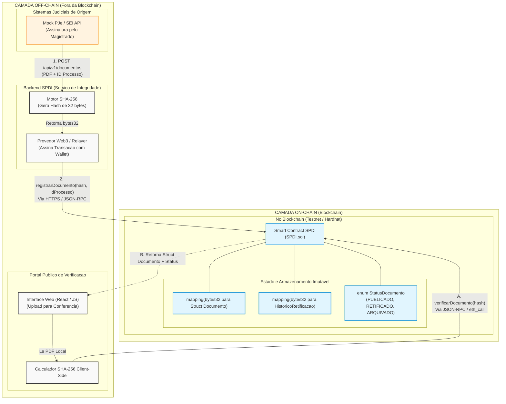

```mermaid
flowchart TB
    %% --- ESTILOS ---
    classDef offchain fill:#f9f9f9,stroke:#333,stroke-width:2px;
    classDef onchain fill:#e1f5fe,stroke:#0288d1,stroke-width:2px;
    classDef external fill:#fff3e0,stroke:#f57c00,stroke-width:2px;

    %% --- CAMADA OFF-CHAIN ---
    subgraph OFFCHAIN_LAYER["CAMADA OFF-CHAIN (Fora da Blockchain)"]
        
        subgraph ORIGEM["Sistemas Judiciais de Origem"]
            PJE["Mock PJe / SEI API<br/>(Assinatura pelo Magistrado)"]:::external
        end

        subgraph BACKEND_SPDI["Backend SPDI (Servico de Integridade)"]
            HASH_ENG["Motor SHA-256<br/>(Gera Hash de 32 bytes)"]:::offchain
            RELAYER["Provedor Web3 / Relayer<br/>(Assina Transacao com Wallet)"]:::offchain
            HASH_ENG -->|"Retorna bytes32"| RELAYER
        end

        subgraph FRONTEND_SPDI["Portal Publico de Verificacao"]
            UI_APP["Interface Web (React / JS)<br/>(Upload para Conferencia)"]:::offchain
            CLIENT_HASH["Calculador SHA-256 Client-Side"]:::offchain
            UI_APP -->|"Le PDF Local"| CLIENT_HASH
        end

    end

    %% --- CAMADA ON-CHAIN ---
    subgraph ONCHAIN_LAYER["CAMADA ON-CHAIN (Blockchain)"]
        
        subgraph BLOCKCHAIN_NODE["No Blockchain (Testnet / Hardhat)"]
            SC["Smart Contract SPDI<br/>(SPDI.sol)"]:::onchain
            
            subgraph STORAGE["Estado e Armazenamento Imutavel"]
                DOC_MAP["mapping(bytes32 para Struct Documento)"]:::onchain
                RET_MAP["mapping(bytes32 para HistoricoRetificacao)"]:::onchain
                ENUM_STATUS["enum StatusDocumento<br/>(PUBLICADO, RETIFICADO, ARQUIVADO)"]:::onchain
            end
            
            SC --- DOC_MAP
            SC --- RET_MAP
            SC --- ENUM_STATUS
        end

    end

    %% --- FLUXOS DE COMUNICACAO ---
    
    %% Fluxo de Registro
    PJE -->|"1. POST /api/v1/documentos<br/>(PDF + ID Processo)"| HASH_ENG
    RELAYER -->|"2. registrarDocumento(hash, idProcesso)<br/>Via HTTPS / JSON-RPC"| SC

    %% Fluxo de Consulta
    CLIENT_HASH -->|"A. verificarDocumento(hash)<br/>Via JSON-RPC / eth_call"| SC
    SC -.->|"B. Retorna Struct Documento + Status"| UI_APP
```